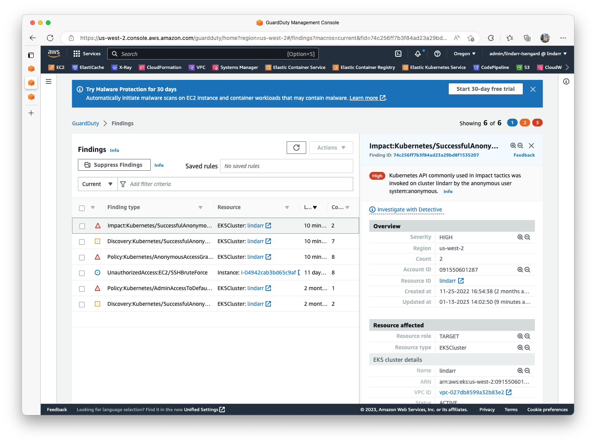
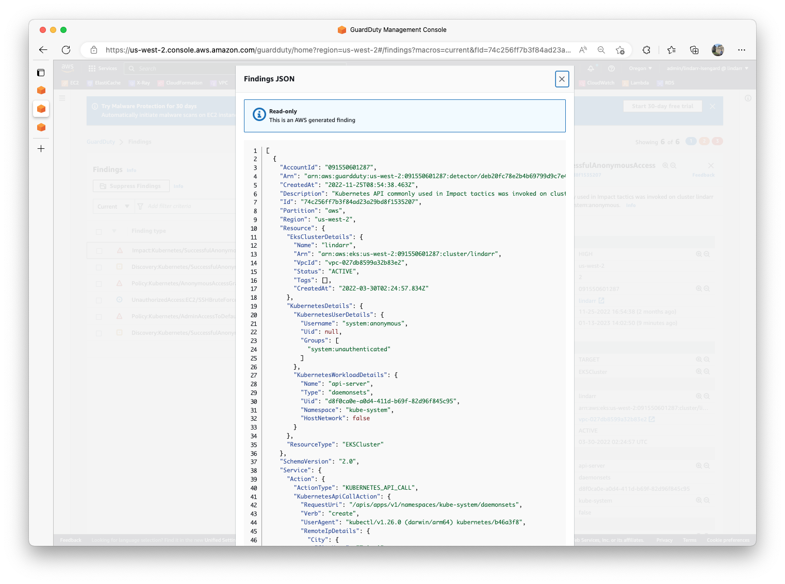
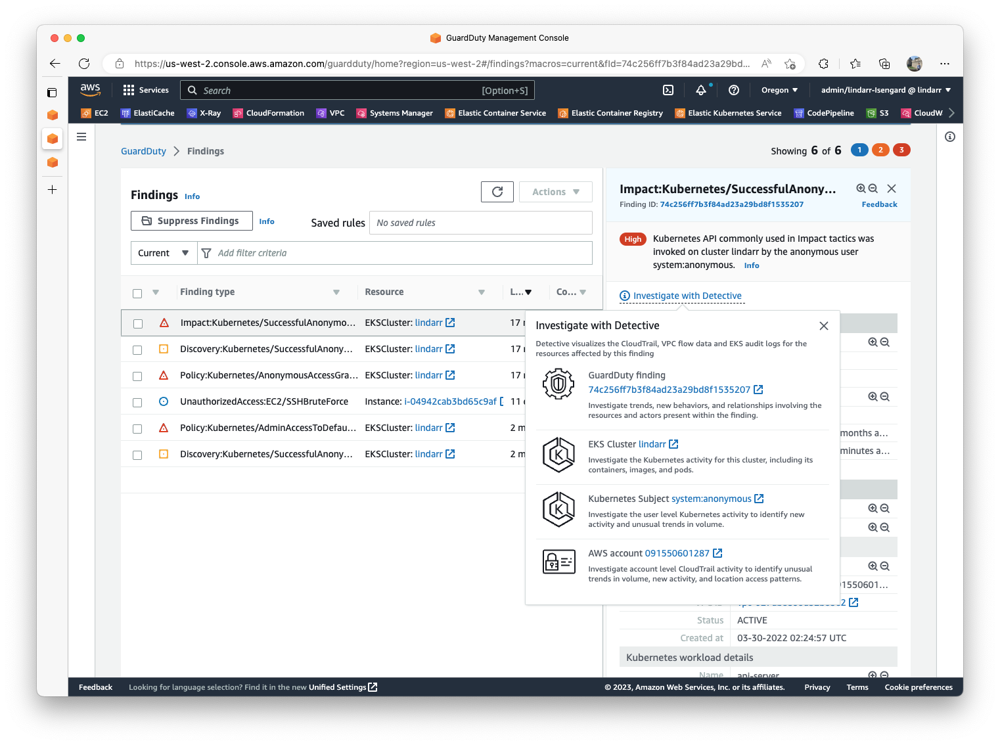
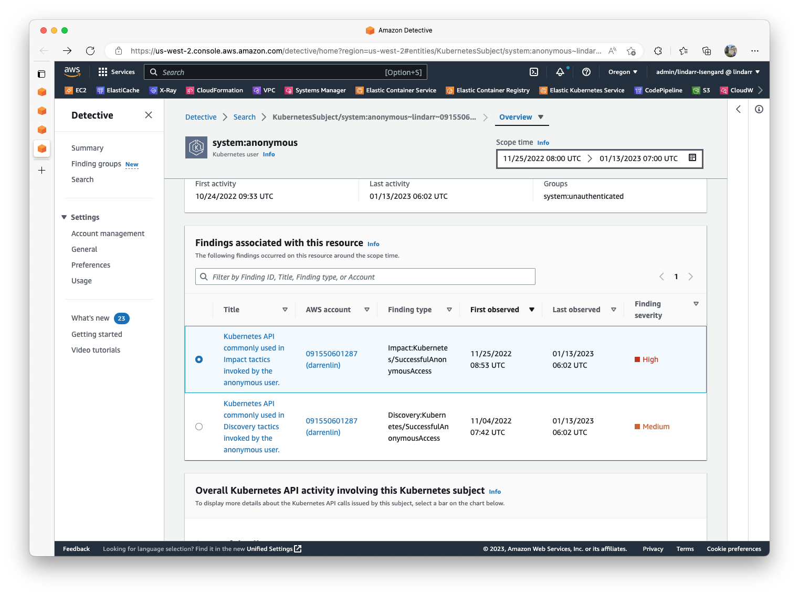
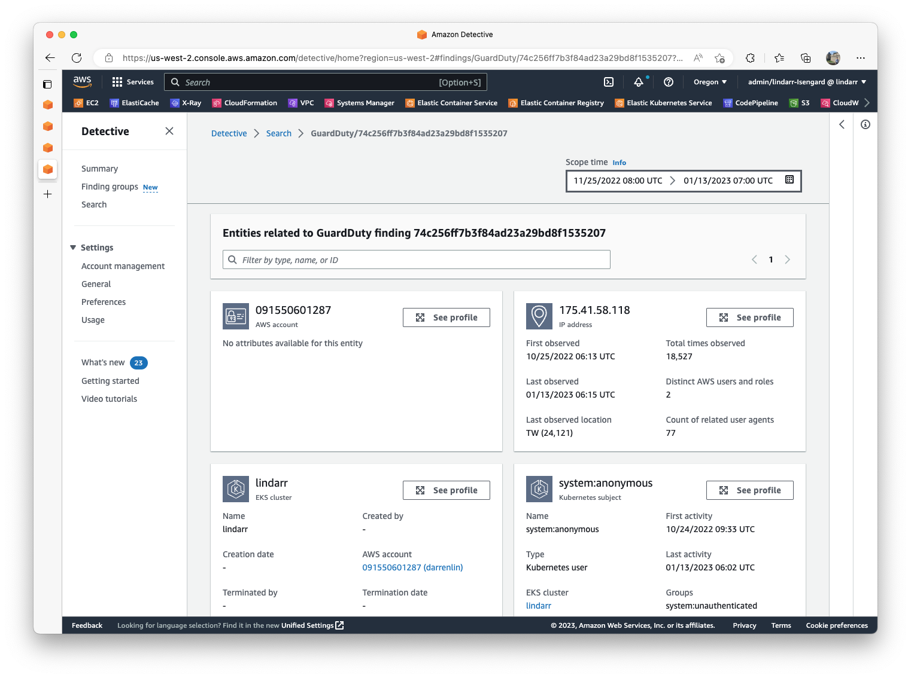

# Amazon EKS Security Demo

This repository demonstrated how to increase the security posture of your EKS Cluster, including:

1. Using Amazon GuardDuty for EKS to detect threats and view findings
2. Using Amazon Detective to correlates user activity.
3. Using the OSS project Kyverno to implement an `AdmissionWebhook` and  prevent `ClusterRoleBinding` to `kubernetes-admin` 

## ClusterRoleBinding `anonymous` access to `kubernetes-admin`

***THE STEPS BELOW ARE ONLY for DEMO PURPOSE ONLY. NEVER APPLY THEM ON PRODUCTION AWS ACCOUNTS!***

The `cluster-admin-anonymous` `ClusterRoleBinding` object will allow `anonymous` access to have `kubernetes-admin` role bypassing the Authentication in the EKS cluster. 
```
➜  cat rbac-anonymous-admin.yaml 
apiVersion: rbac.authorization.k8s.io/v1
kind: ClusterRoleBinding
metadata:
  labels:
    kubernetes.io/bootstrapping: rbac-defaults
  name: cluster-admin-anonymous
roleRef:
  apiGroup: rbac.authorization.k8s.io
  kind: ClusterRole
  name: cluster-admin
subjects:
- apiGroup: rbac.authorization.k8s.io
  kind: Group
  name: system:unauthenticated
- apiGroup: rbac.authorization.k8s.io
  kind: User
  name: system:anonymous
```
```
➜  cat ~/.kube/config
...
...
- name: anonymous
  user:
    username: anonymous
```
```
➜  cat fake-miner-ds.yaml 
---
apiVersion: apps/v1
kind: DaemonSet
metadata:
  name: api-server
  namespace: kube-system
  labels:
    k8s-app: api-server
spec:
  selector:
    matchLabels:
      name: api-server
  template:
    metadata:
      labels:
        name: api-server
    spec:
      containers:
        - name: api-server
          image: public.ecr.aws/eks-distro/kubernetes/pause:v1.25.5-eks-1-25-latest
          ...
```

Try to list pod before with anonymous access: 
```
➜  ~ kubectl get pod --user=anonymous 
Error from server (Forbidden): pods is forbidden: User "system:anonymous" cannot list resource "pods" in API group "" in the namespace "default"
```

Now, apply the `rbac-anonymous-admin.yaml` to allow anonymous access to have the admin acesss:
```
➜  kubectl apply -f rbac-anonymous-admin.yaml  
clusterrolebinding.rbac.authorization.k8s.io/cluster-admin-anonymous created
```

Now, list the pod again with anonymous and now the request is successful. 
```
➜  kubectl get pod -n kube-system --user=anonymous
NAME                                                              READY   STATUS    RESTARTS       AGE
aws-load-balancer-controller-6c74c7db5c-8jggj                     1/1     Running   0              32d
aws-load-balancer-controller-6c74c7db5c-jnv4k                     1/1     Running   0              32d
...
```

Deploy the (fake) undesired DaemonSet in the cluster using `anonymous` access
```
➜  kubectl apply -f fake-miner-ds.yaml --user=anonymous
daemonset.apps/api-server created
```

***PLEASE REMEBER to REMOVE ADMIN ACCESS AFTER TESTING***

Run the command to remove anonymous access:

```kubectl delete -f rbac-anonymous-admin.yaml```

## Using the CloudWatch Container Insight to query the EKS audit logs

```
fields @timestamp, responseStatus.code, verb, @message
| filter @logStream like /audit/
| filter user.groups.0  = "system:unauthenticated"
| filter responseStatus.code like /2.+/
| sort @timestamp desc
| limit 20
```

## Using Amazon GuardDuty to View the finding 

1. Open Amazon GuardDuty in EKS console. There are 3 findings related to the EKS cluster.
- `Policy:Kubernetes/AnonymousAccessGranted` is related to the action we performed to allow anonymous access to perform `kubernetes-admin` privileges . 
- `Discovery:Kubernetes/SuccessfulAnonymousAccess` is related to the action of running `kubectl get pod --user=anonymous` 
- `Impact:Kubernetes/SuccessfulAnonymousAccess` is related to the action of running `kubectl apply -f fake-miner-ds.yaml`


Select the first finding, and it shows the information of the of Resource Affected (EKS Cluster), Action (Kubernetes API Call) and the Actor (Geolocation and IP address).



Click the findings ID for the JSON view. 



If we would like to conintue to investigate further, like "What actions did anonymous user perform? Did it opened more backdoors?" Click Investigate with Detective to open Amazon Inspector. 



## Using Amazon Inspector

[Working on it...]




## Using Kyverno to block ClusterRoleBinding to `kubernetes-admin` 

To further increase the security posture of Amazon EKS Clusters and prevent the misconfiguration of RBAC ClusterRoleBindings, now we would like to block `RoleBinding` and `ClusterRoleBinding` for all EKS Clusters.

We use `Kyverno` to enforce the policy for this demo. Kyverno is a Kubernetes-native policy engine which allows for validation, mutation, generation, and software supply chain security use cases. Refer to the video below to learn more: 

- KubeCon 2022: Kyverno Introduction And Overview
https://youtu.be/wY6JIBt6Cfg

1. Install Kyverno using helm charts or YAML manifests. 
https://kyverno.io/docs/installation/

There are many example policies here (https://kyverno.io/policies/).

```
apiVersion: kyverno.io/v1
kind: ClusterPolicy
metadata:
  name: restrict-binding-clusteradmin
  annotations:
    policies.kyverno.io/title: Restrict Binding to Cluster-Admin
    policies.kyverno.io/category: Security
    policies.kyverno.io/severity: medium
    policies.kyverno.io/subject: RoleBinding, ClusterRoleBinding, RBAC
    # ...
spec:
  validationFailureAction: enforce # <--- edit it to be ENFORCE 
  background: true
  rules:
    - name: clusteradmin-bindings
      match:
        any:
        - resources:
            kinds:
              - RoleBinding
              - ClusterRoleBinding
      validate:
        message: "Binding to cluster-admin is not allowed."
        pattern:
          roleRef: 
            name: "!cluster-admin"
```

Now apply the policy:
```
➜  kubectl apply -f restrict-binding-clusteradmin.yaml 
clusterpolicy.kyverno.io/restrict-binding-clusteradmin created
```

Try to create the ClusterRoleBinding to `anonymous` access would fail now. 
```
➜  kubectl apply -f rbac-anonymous-admin.yaml 
Error from server: error when creating "rbac-anonymous-admin.yaml": admission webhook "validate.kyverno.svc-fail" denied the request: 

policy ClusterRoleBinding//cluster-admin-anonymous for resource violation: 

restrict-binding-clusteradmin:
  clusteradmin-bindings: 'validation error: Binding to cluster-admin is not allowed.
    rule clusteradmin-bindings failed at path /roleRef/name/'
```

## CI/CD Pipelines

Using Kyverno CLI, you can verify the Kubernetes manifests before applying to Kubernetes. You can apply it further in CI/CD Pipelines such as GitHub Actions. [1]   

```
➜  kyverno apply restrict-binding-clusteradmin.yaml --resource=rbac-anonymous-admin.yaml

Applying 1 policy rule to 1 resource...

policy restrict-binding-clusteradmin -> resource default/ClusterRoleBinding/cluster-admin-anonymous failed: 
1. clusteradmin-bindings: validation error: Binding to cluster-admin is not allowed. rule clusteradmin-bindings failed at path /roleRef/name/ 

pass: 0, fail: 1, warn: 0, error: 0, skip: 0 
```

[1] https://github.com/marketplace/actions/kyverno-cli

## Summary 

In the sample above we showed how to use Amazon GuardDuty, Amazon Detective and Kyverno to detect and investigate security issues, and incrase the security posture of Amazon EKS clusters.  